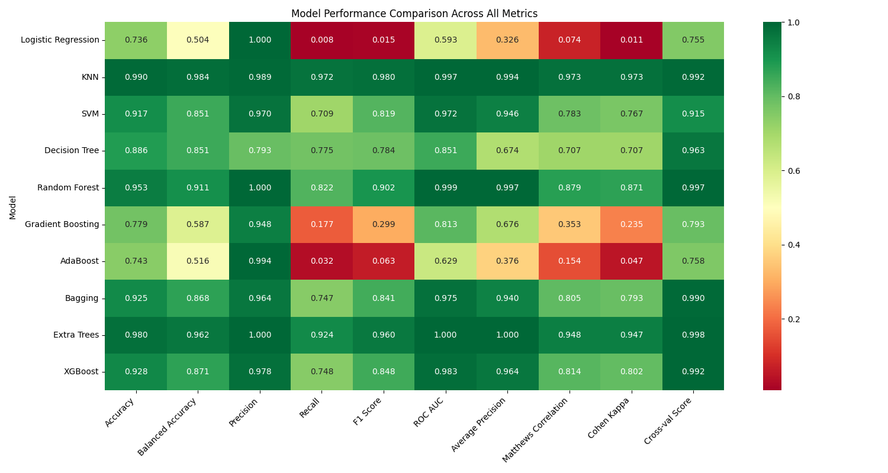

<h1 style="color:#FFD600;">Auto Insurance Fraud Detection App</h1>


A modern, multipage Streamlit web app for predicting auto insurance fraud, visualizing EDA reports, and benchmarking model performance. Built for Learnathon 4.0.

---

## 🚀 Features
- **Fraud Prediction:**
  - Select or manually enter claim data to predict fraud using a variety of ML models.
  - Choose your model from the sidebar (all models in `models/` are available).
- **EDA Report:**
  - View a full interactive EDA report (`EDA/report.html`) directly in the app.
- **Benchmarks:**
  - Visualize model performance with a heatmap (`models/benchmark_results_heatmap.png`).
- **Modern UI:**
  - Black, light green, and orange color scheme for high contrast and accessibility.
  - Sidebar navigation with clear, highlighted active page.
  - Responsive, card-based layout.
- **Custom Cache Directory:**
  - All Streamlit cache is stored in the `log/` directory for easy management.

---

## 🗂️ App Structure & Navigation
- **Sidebar Navigation:**
  - **EDA Report:** Embedded HTML EDA report.
  - **Prediction:** Main fraud prediction workflow.
  - **Benchmarks:** Model performance heatmap.
- **Model Selection:**
  - Choose any available model pipeline from the sidebar dropdown.
- **Resources Used:**
  - `public/logo.jpg` — App logo (shown in sidebar and header)
  - `EDA/report.html` — EDA report (displayed in EDA Report page)
  - `models/benchmark_results_heatmap.png` — Benchmark heatmap (displayed in Benchmarks page)

---

## 🖥️ How to Run
1. **Install requirements:**
   ```bash
   pip install -r requirements.txt
   ```
2. **Run the app:**
   ```bash
   streamlit run app.py
   ```
3. **Navigate:**
   - Use the sidebar to switch between EDA Report, Prediction, and Benchmarks.
   - Select a model and fill in claim details to get predictions.

---

## 📁 Project Layout
```
├── app.py                  # Main Streamlit app (multipage)
├── requirements.txt        # Python dependencies
├── public/
│   └── logo.jpg            # App logo
├── models/
│   ├── *.pkl               # Model pipelines
│   └── benchmark_results_heatmap.png  # Benchmark heatmap
├── EDA/
│   └── report.html         # EDA HTML report
├── transformed_data/       # Processed data files
├── data/                   # Raw data files
├── log/                    # Streamlit cache
└── README.md               # This file
```

---

## 🖼️ Example Screenshots
- **App Logo:**
  
- **Benchmarks Heatmap:**
  

---

## ⚙️ Customization & Notes
- **Color Scheme:** Black, light green (`#bbf7d0`), and orange (`#f59e42`).
- **Cache:** All Streamlit cache is stored in `log/`.
- **Add Models:** Place new model `.pkl` files in `models/` to make them available in the app.
- **Update EDA:** Replace `EDA/report.html` to update the EDA page.
- **Benchmarks:** Update `models/benchmark_results_heatmap.png` for new results.

---

## 👥 Team Members
- R Kiran Kumar Reddy
- Vishnu Prasad Korada
- A Paritos
- Tusharkanta Behera

---

## 🙏 Credits
- Built for **Learnathon 4.0**
- UI inspired by modern dashboard best practices
- Powered by [Streamlit](https://streamlit.io/)

---

© 2025 Learnathon 4.0 — Auto Insurance Fraud Detection App
